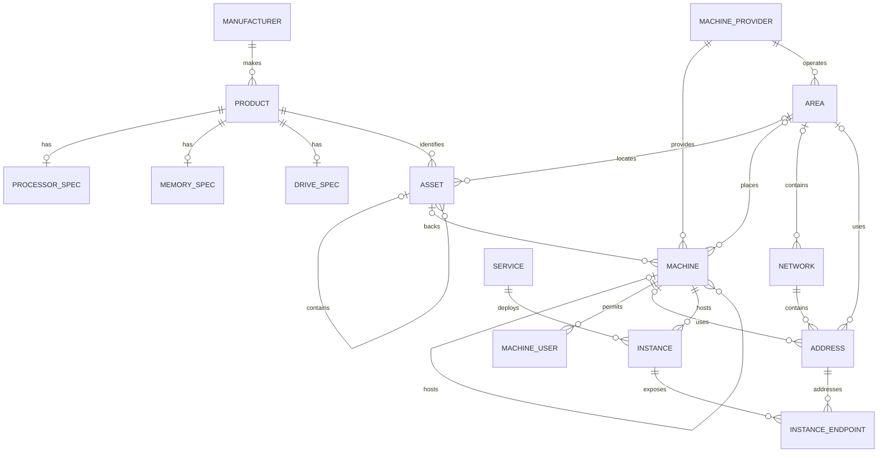

# HLIMS Domain Model

HLIMS is the Home Lab Information Management System. It records owned hardware,
runnable machines, network addresses, and where infrastructure exists. It does
not provision resources, monitor utilization, or proxy service traffic.

## Identifiers

User-addressable resources have two generated identifiers:

- `id` is an internal UUIDv7 primary key used for database relationships.
- `public_id` is a lowercase, 12-character NanoID used by APIs and URLs.

Names are user-editable display values and are not identifiers. Provider IDs,
serial numbers, and system UUIDs identify records in external systems but are
not database primary keys. Extension tables and other records that cannot exist
independently use their parent's internal ID and do not have a public ID.

Named resources preserve display capitalization in `name` and use a lowercase
kebab-case `slug` as their stable machine-readable key. Names are
case-insensitive unique globally or within their natural parent scope. Changing
a name does not implicitly change an existing slug.

## Inventory

### Manufacturer and Product

A Manufacturer provides one canonical identity for names such as HP, Framework,
and Microsoft. A Product belongs to a Manufacturer and describes a kind of
physical item that exists in the catalog. Product kinds are `system`,
`processor`, `memory`, and `drive`. Processor, memory, and drive specification
tables contain fields that do not apply to other kinds. Processor specifications
include cores, threads, base clock, and virtualization. Drive media kinds are
`hdd` and `ssd`; interface kinds are `sata`, `sas`, `nvme`, `usb`, `scsi`,
`virtio`, and `virtual`.

### Asset

An Asset is one physical instance of a Product that is owned or managed. Asset
placement is explicit: directly in an Area, contained by a system Asset, or
unplaced. Contained Assets derive their effective Area from their ancestors.
Installation history, slots, and lifecycle states will be added only if a real
workflow requires them.

### Machine Provider

A Machine Provider is the organization or environment responsible for supplying
and operating a Machine. Current providers are Homelab and DigitalOcean. Every
Machine and Area belongs to a Machine Provider. A Machine Provider may have one
raster logo stored in SQLite; the image is fetched separately from provider
metadata and topology responses.

### Area

An Area is the current high-level placement concept. Current Areas are Primary
Home and DigitalOcean `sfo3`. Every Area belongs to a Machine Provider. Area
kinds and subdivisions are deferred until they are needed.

## Compute

### Machine

A Machine is a runnable compute environment and is the primary catalog
resource. Machine kinds are `bare_metal` and `virtual_machine`.
A bare-metal Machine may reference a system Asset. A locally hosted virtual
Machine references its parent Machine. A provider-hosted Machine has no known
parent or physical Asset.

Machines can be marked as favorites to identify the most useful entries for
navigation and other inventory clients. The flag is presentation-neutral and is
included in both Machine resources and topology snapshots.

Machine capacity records the logical resources available to the environment:
CPU count, memory, storage, and included transfer. Physical component details
remain available through the related Asset. CPU allocation is `shared` or
`dedicated`. Bare-metal Machines use `dedicated`; virtual Machines depend on
whether their processor time is shared or exclusively allocated.

The currently recorded WSL2 virtualization platform remains descriptive text
rather than a closed enum.

### Machine User

A Machine User records a login identity available on one Machine. Usernames are
case-sensitive and constrained to shell-safe ASCII account names. At most one
user is preferred per Machine. The preferred user and the Machine's recorded
hostname or Addresses allow clients to construct generic `ssh user@host`
commands; HLIMS does not store private keys, credentials, or SSH host trust.

## Networking

### Network

A Network defines an address scope. Network kinds are `lan`, `tailnet`,
`cloud_vpc`, and `public`.

### Address

An Address belongs to a Network and is assigned to either a Machine or an Area.
Area addresses support facts such as a home's public ISP address when no router
Machine is cataloged.

This is currently an address inventory rather than a routed-topology model. The
staged plan for multiple LANs, router interfaces, prefixes, VLAN attachments,
and typed Network relationships is documented in
[Home Network](home-network.md#hlims-impact).

## Navigation

### Service and Instance

A Service is a conceptual application or capability, such as Grafana or
OpenCode. An Instance is a deployment of one Service on one Machine and records
its backend port. Machines, Services, and Instances have stable navigation slugs
used by canonical redirect paths. A Service may have one raster logo stored in
SQLite for API clients and inventory consoles; logo bytes are fetched separately
so ordinary Service listings remain small.

### Instance Endpoint

An Instance Endpoint describes one client-facing way to reach an Instance. It
references an Address and records the external scheme, port, and base path. This
separates an application's backend listener from LAN access, direct Tailnet
access, and Tailscale Serve. One endpoint may be preferred for canonical routes.

HLIMS resolves canonical `{machine}/{service}/{instance}` paths and ad hoc
`{machine}/{port}` paths to endpoints. It returns an HTTP redirect and never
proxies the resulting traffic.

## Relationships

The first inventory migration establishes these records and constraints. The
API exposes every inventory aggregate as a complete CRUD resource. Product
writes atomically replace the Product and its kind-specific specification. Asset
writes use an explicit placement object. See
[HLIMS Sample Data](sample-data.md) for a review fixture covering every current
application table.
