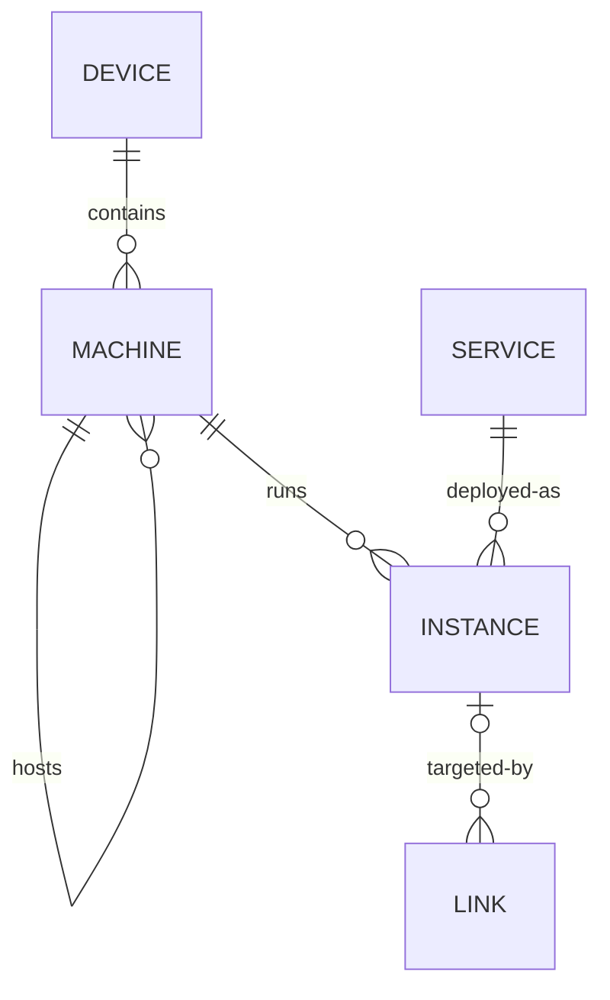

# HLIMS Domain Model

HLIMS is the Home Lab Information Management System. It records where personal
infrastructure and services exist and gives users direct navigation to them.
It does not provision resources or proxy service traffic.

## Resources

### Device

A physical piece of hardware, such as a mini PC or Surface Book.

### Machine

A runnable operating-system host. A Machine may represent an installation on a
physical Device or a virtual machine hosted by another Machine.

### Service

A conceptual application or capability, such as OpenCode, Grafana, or Proxmox.

### Instance

A deployment of a Service on a Machine. An Instance owns the direct URL used to
reach that deployment.

### Link

A memorable short name that redirects to an Instance or an arbitrary URL.
Existing golink destination templates remain supported during the initial
HLIMS evolution.

## Relationships

The initial catalog will validate these relationships against real homelab
entries before adding tags, discovery, health checks, or lifecycle automation.
