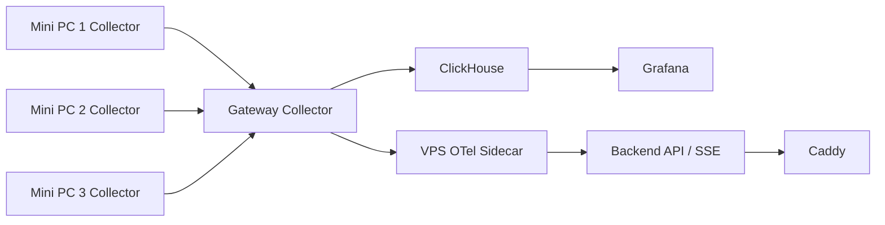

# Initial Platform Plan

Status: deferred on 2026-09-12.

The current provisioning direction is documented in
[Zero-Touch Provisioning](../architecture/zero-touch-provisioning.md). This
archive records design intent; the provisioning and attestation systems were
not implemented on the archived branch.

The current telemetry evaluation is documented in
[Observability](../architecture/observability.md). The custom metrics streaming
path below remains historical rather than part of the current recommendation.

This document preserves the original ideas for a more automated homelab
platform. The implementation was removed from `main` so the repository can
focus on deploying useful services first. The exact former tree is retained on
the `archive/initial-platform-plan-2026-09-12` branch.

## Device provisioning

The provisioning system would own the bare-metal lifecycle from power-on with
no operating system through installation and first boot. The proposed flow was:

- ProxyDHCP through [dnsmasq](https://thekelleys.org.uk/dnsmasq/doc.html) to
  provide PXE boot information without replacing the router's DHCP server.
- TFTP delivery of an initial [iPXE](https://ipxe.org/) bootloader.
- iPXE routing based on device metadata.
- OS installation through [netboot.xyz](https://netboot.xyz/) without locally
  maintaining installer images.
- [cloud-init](https://cloud-init.io/) configuration for first-boot setup.

## Device attestation

The attestation service would provide secure, zero-touch device onboarding
using a TPM hardware root of trust. Devices would prove that the TPM is genuine
through Endorsement Key validation, that their boot state is untampered through
Platform Configuration Register measurements, and that their identity is
authentic through Attestation Key certificate signing. The service would then
issue a certificate representing the trusted device identity.

Resources:

- [How Google enforces boot integrity on production machines](https://docs.cloud.google.com/docs/security/boot-integrity#measured-boot-process)
- [Remote attestation of disaggregated machines](https://docs.cloud.google.com/docs/security/remote-attestation)
- [Securing The Edge: Onboarding Devices With Confidence](https://edgemonsters.dev/blog/secure-onboarding/)
- [Living on the Edge, Part 0](https://brianchambers.substack.com/p/chamber-of-tech-secrets-45)
- [Living on the Edge, Part I](https://brianchambers.substack.com/p/living-on-the-edge-part-i-establishing)
- [Living on the Edge, Part II](https://brianchambers.substack.com/p/secure-device-onboarding)

## Metrics collection

Each PC would run an [OpenTelemetry Collector](https://opentelemetry.io/docs/collector/)
as a systemd-managed binary using the host metrics receiver. The collectors
would send OTLP gRPC data to a central gateway collector.

The gateway would fan metrics out to:

- ClickHouse for long-term storage, queried by a self-hosted Grafana instance.
- An OTel sidecar beside a backend API on a VPS. The API would stream live
  metrics over server-sent events to a SPA at `homelab.tylertries.com`, with
  Caddy terminating TLS.

## Why it is deferred

Provisioning, attestation, and a custom metrics path add substantial platform
work before the homelab hosts useful applications. They remain possible future
phases after the management homepage, tailnet navigation, and per-node services
are stable.
